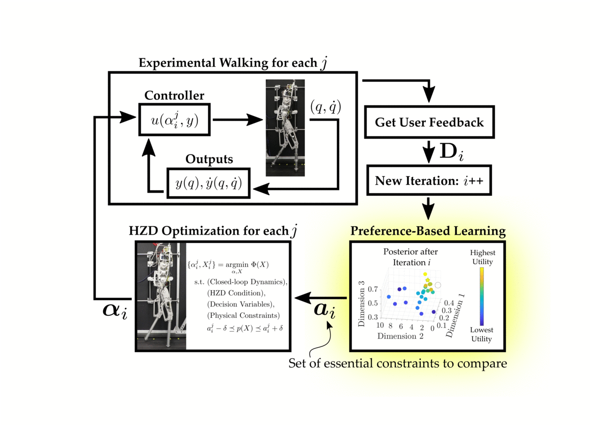

### Supplementary Video

<iframe width="560" height="315" src="https://www.youtube.com/embed/rLJ-m65F6C4" title="YouTube video player" frameborder="0" allow="accelerometer; autoplay; clipboard-write; encrypted-media; gyroscope; picture-in-picture" allowfullscreen></iframe>

### Abstract
This paper presents a framework that leverages both control theory and machine learning to obtain stable and robust bipedal locomotion without the need for manual parameter tuning. Traditionally, gaits are generated through trajectory optimization methods and then realized experimentally --- a process that often requires extensive tuning due to differences between the models and hardware. In this work, the process of gait realization via hybrid zero dynamics (HZD) based optimization problems is formally combined with preference-based learning to systematically realize dynamically stable walking. Importantly, this learning approach does not require a carefully constructed reward function, but instead utilizes human pairwise preferences. The power of the proposed approach is demonstrated through two experiments on a planar biped AMBER-3M: the first with rigid point feet, and the second with induced model uncertainty through the addition of springs where the added compliance was not accounted for in the gait generation or in the controller. In both experiments, the framework achieves stable, robust, efficient, and natural walking in fewer than 50 iterations with no reliance on a simulation environment. These results demonstrate a promising step in the unification of control theory and learning. 

### Learning Framework
The proposed procedure combines the Hybrid Zero Dynamics (HZD) approach to gait generation with a preference-based learning framework to achieve stable and robust experimental walking on the planar biped AMBER-3M. In general, preference-based learning is Bayesian optimization in the dueling-bandit setting. For a good overview on Bayesian optimization, we refer to this wonderful <a href = "https://distill.pub/2020/bayesian-optimization/" target = "_blank"> tutorial </a>. More specifically, we consider the "k-armed dueling bandits problem", originally presented <a href="https://www.cs.cornell.edu/people/tj/publications/yue_etal_09a.pdf" target="_blank"> here </a>. For clarity we will outline the following scenarios:

#### The conventional one-armed bandit setting: 
- A player has to choose which slot machine to play in a row of slot machines. Each time the player tries a slot machine, they obtain information of what that slot machine's payout was.

#### The multi-armed bandit setting:
- A player must choose which machines to play, how many times to play each machine, and in which order to play them. In each iteration, the player recieves information from all of the played slot machines and can update their decision of which slot machines to play during the next iteration.

#### The dueling bandit setting:
- A player can play 2 slot machines in each iteration. However, the only information they receive after playing the slot machines is which machine gave them a higher payout.

#### The k-armed dueling bandit setting:
- A player can play $$k$$ slot machines during each iteration. After playing the slot machines, the user receives a ranking of the payouts of the played slot machines.

Thus, since are operating within the the k-armed dueling bandit setting, we query the human operator for a ranking of the executed gaits. In all of our experiments, we select $$k = n = 2$$, which means that the ranking is simply a single pairwise preference.

In general, the learning framework is as follows:

1. Actions are sampled using the Self-Sparring approach to Thompson sampling. In general, Thompson sampling draws samples from a distribution and then selects the actions that maximize the drawn samples. In our framework, we choose to conduct Thompson sampling over the posterior distribution 
$$\mathcal{P}(\boldsymbol{U}_{\mathbf{S}_i} | \mathbf{D}_{i-1})$$ where $${\mathbf{S}_i}$$ is defined as the subset of actions $$\mathbf{S}_i := \mathbf{L}_i \cup \mathbf{E}_{i-1}$$. Here, $$ \mathbf{L}_i $$ is a random line drawn to intersect with the algorithms last belief of the optimal action $$a^*_{i-1}$$ and $$\mathbf{E}_{i-1}$$ is the set of previously executed actions up to and including iteration $$i-1$$.

2. The sampled actions are given to the HZD optimization problem and $$n$$ gait trajectories are computed.

3. These generated gaits are executed on the physical robot. The human operator observes the experimental behavior of all of the generated gaits before providing feedback.

4. The human is queries for pairwise preferences, and these preferences are appended to the feedback dataset.

5. The preference-based learning framework is given the updated dataset, and updates its belief of the underlying utilities of the executed actions, 
$$\mathcal{P}(\boldsymbol{U}_{\mathbf{E}_{i}} | \mathbf{D}_{i})$$.
This posterior distribution is approximating using the Laplace approximation, which provides us with the normal distribution $$\mathcal{N}(\mu {\mathbf{E}{i}}, \Sigma {\mathbf{E}i})$$. 

6. The next iteration then begins by repeating these steps using the new updated posterior distribution.

### Experimental lessons we learned
The main takeaway we had from our experiments is how well the preference-based learning framework was able to learn "good" walking. This was even more suprising considering that the only information we were providing to the learning algorithm was pairwise preferences. However, despite our skepticism, the learning algorithm achieved stable and robust walking for the rigid point-foot model very quickly. The decision to repeat the learning framework on the spring-foot model was actually made because of our surpise at how well it worked the first time. And to our surprise again, the framework again learned "good" walking within only a few hours.

In general, I would encourage anybody who has some aspect of "parameter tuning" to try using preference-based learning as it is very successful at systematically tackling these tuning processes. This is especially true for new robot operators who may struggle with hand-tuning. One drawback of the approach that we would like to note is that it is not always intuitive how to construct your search space to ensure that a "good" action *exists* within the search space. More bluntly put: if you construct your search space such that none of the parameter combinations lead to good walking, you will never acheive good walking. The question of *how* to construct your search space so as to guarantee that a good solution does exist is an open area of research.

### Full AMBER3M-PF Experimental Video
Full-length experimental videos for all of the learning iterations with AMBER3M-PF (AMBER-3M with the point-foot configuration) are shown in the video below:

<iframe width="560" height="315" src="https://www.youtube.com/embed/sf18eKgqleM" title="YouTube video player" frameborder="0" allow="accelerometer; autoplay; clipboard-write; encrypted-media; gyroscope; picture-in-picture" allowfullscreen></iframe>

### Full AMBER3M-PF Experimental Results
The results of the learning algorithm for the AMBER3M-PF experiments are included in the repository <a href="https://github.com/maegant/ICRA2021-LearningHZD/tree/main/Results/AMBER-P" target="_blank">here</a>.

### Full AMBER3M-SF Experimental Video
Full-length experimental videos for all of the learning iterations with AMBER3M-SF (AMBER-3M with the spring-foot configuration) are shown in the video below:

<iframe width="560" height="315" src="https://www.youtube.com/embed/51i68dho3YA" title="YouTube video player" frameborder="0" allow="accelerometer; autoplay; clipboard-write; encrypted-media; gyroscope; picture-in-picture" allowfullscreen></iframe>

### Full AMBER3M-SF Experimental Results
The results of the learning algorithm for the AMBER3M-SF experiments are included in the repository <a href="https://github.com/maegant/ICRA2021-LearningHZD/tree/main/Results/AMBER-S" target="_blank">here</a>.

### If you have any questions regarding our work, please contact us
[mtucker@caltech.edu](mailto:maegant@caltech.edu)